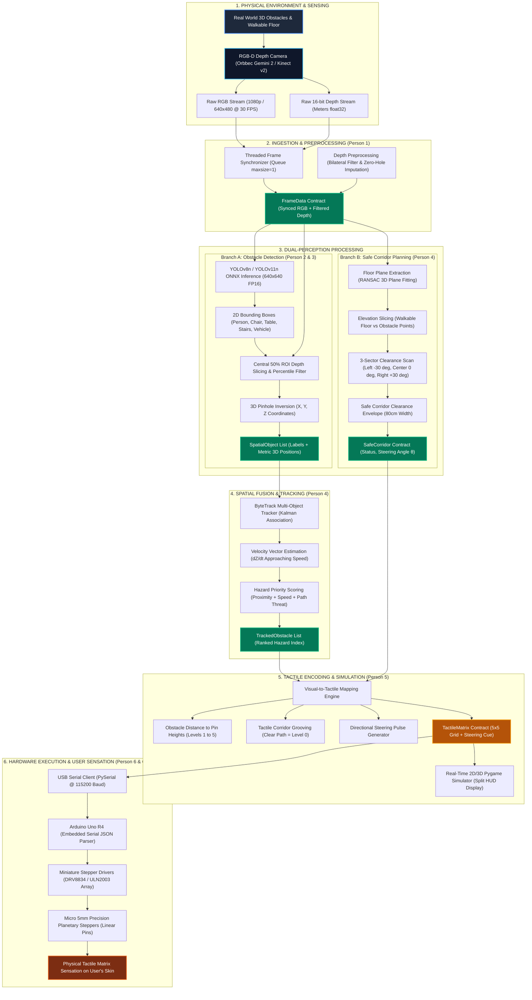
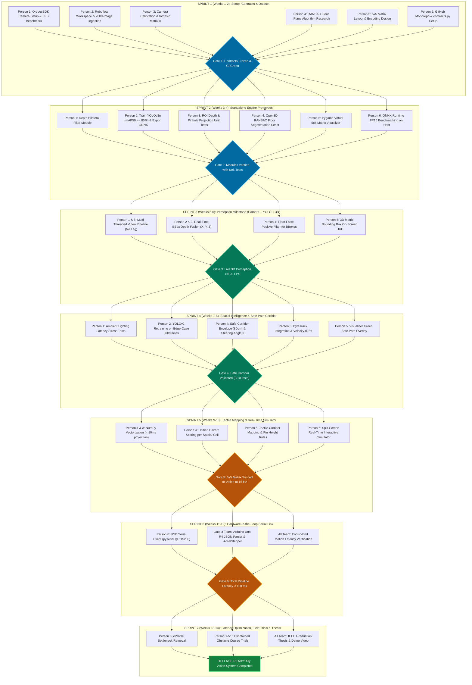
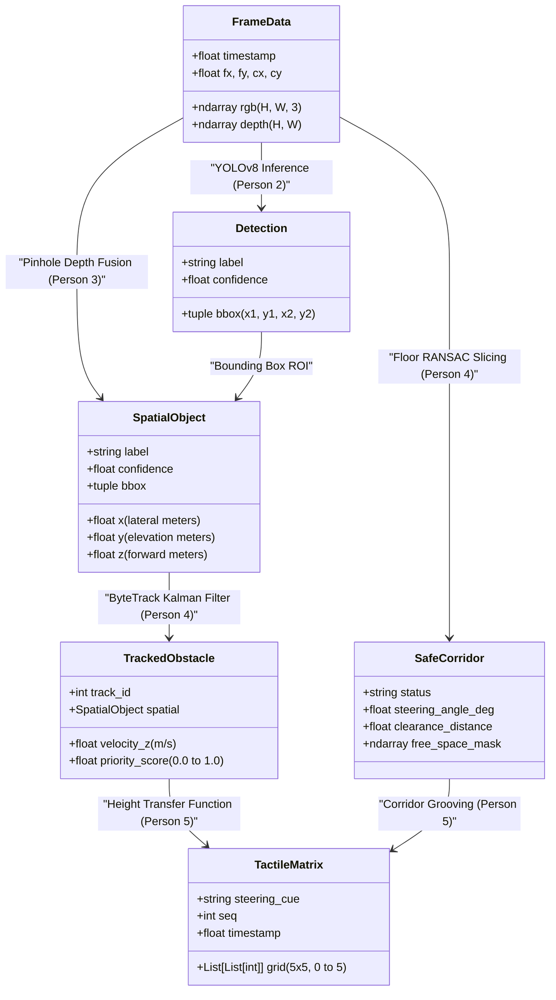
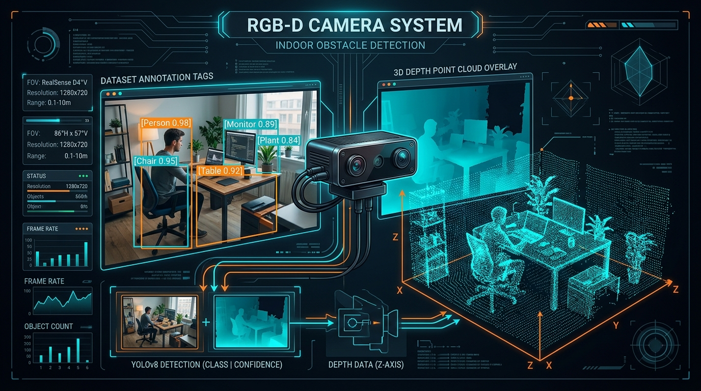
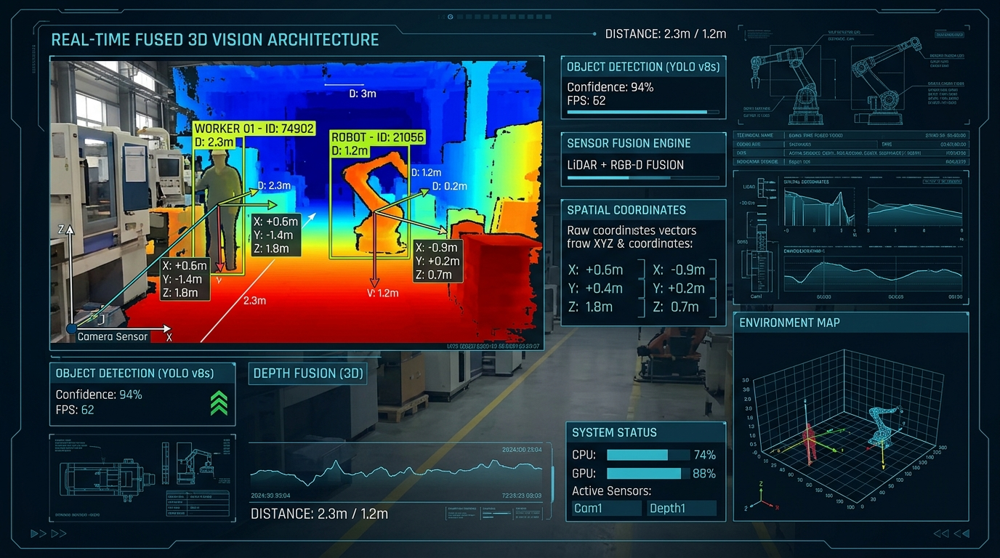
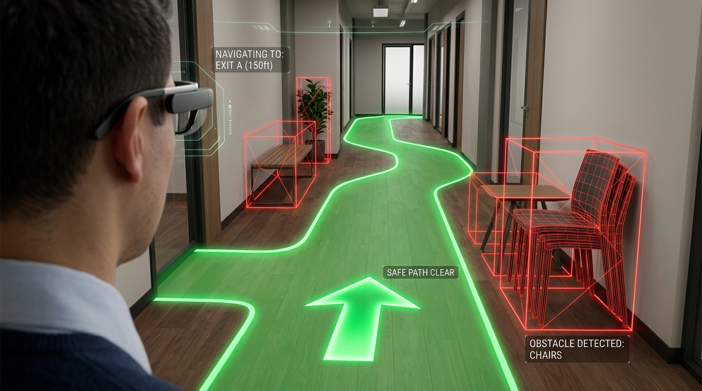

# Ally Vision — Complete AI & Spatial Processing System Specification

> **Subsystem:** Edge AI, Spatial Vision & Safe Path Planning Subsystem  
> **Project:** Ally Vision (Visual-to-Tactile Assistive Navigation System)  
> **Target Platform:** Edge PC / Laptop (Host) communicating with Arduino Uno R4 (Actuator Controller)  
> **Sensors:** RGB-D Depth Camera (Orbbec Gemini 2 / Microsoft Kinect v2)  
> **Output:** $5 \times 5$ Tactile Matrix (Tactile Corridor & Hazard Height Profiles)  
> **AI Team Size:** 6 Engineers  

---

## 1. Visual System Architecture & End-to-End Dataflow

The complete processing pipeline from the physical world to the user's skin is illustrated below:



---

## 2. 7-Sprint Agile Lifecycle & Team Track Flowchart

The 14-week execution roadmap, showing how the 6 AI engineers work concurrently across the 7 sprints:



---

## 3. Data Flow Contract Transformations

The internal state transitions through five immutable data schemas across the pipeline:



---

## 4. AI Subsystem Scope & Architectural Boundaries

```
┌────────────────────────────────────────────────────────────────────────────────────────┐
│                        ALLY VISION AI SUBSYSTEM BOUNDARY                               │
│                                                                                        │
│  [RGB-D Camera]                                                                        │
│        │                                                                               │
│        ▼                                                                               │
│  ┌───────────────┐     ┌───────────────┐     ┌───────────────┐     ┌───────────────┐   │
│  │ 1. SENSOR     │ ──> │ 2. PERCEPTION │ ──> │ 3. SPATIAL &  │ ──> │ 4. TACTILE    │   │
│  │    PIPELINE   │     │ (YOLOv8/11)   │     │    PATH PLAN  │     │    ENCODING   │   │
│  └───────────────┘     └───────────────┘     └───────────────┘     └───────┬───────┘   │
│                                                                            │           │
└────────────────────────────────────────────────────────────────────────────┼───────────┘
                                                                             │ USB Serial
                                                                             ▼ (JSON/Bytes)
                                                                    [Arduino Uno R4]
```

### Strictly Within AI Scope:
* Real-time acquisition and hardware synchronization of RGB and Depth streams.
* Preprocessing, bilateral filtering, and zero-depth hole interpolation.
* Object detection fine-tuned on navigation-critical obstacle classes.
* Metric 3D spatial coordinate projection ($X, Y, Z$) using pinhole camera geometry.
* Ground plane extraction (RANSAC) and walkable free-space corridor detection.
* Multi-obstacle temporal tracking (ByteTrack) and approaching velocity calculation ($\Delta Z / \Delta t$).
* Hazard priority scoring combining proximity, trajectory, and class danger.
* Visual-to-tactile encoding: converting the 3D world model into a dynamic $5 \times 5$ pin height matrix.
* Virtual software tactile simulator (GUI) for validation without hardware.
* Serial communication transmission over USB to Arduino Uno R4.

### Strictly Outside AI Scope (Handled by Output/Hardware Team):
* Stepper motor STEP/DIR pulse generation and timing.
* Current limiting, H-bridge driver control, and thermal dissipation.
* Mechanical homing, limit switches, and physical pin travel limits.

---

## 5. Core Technical Architecture & Repository Structure

All 6 team members work in a single modular repository with strict interface contracts:

```text
ally-vision-ai/
│
├── config/
│   └── config.yaml               # Thresholds, camera intrinsics, COM port, class weights
│
├── core/
│   ├── contracts.py              # Unified Dataclasses schemas (Ground truth for all members)
│   └── logger.py                 # Structured latency and diagnostic logging
│
├── camera/                       # [Person 1 Owner]
│   ├── orbbec_stream.py          # OrbbecSDK wrapper
│   ├── kinect_stream.py          # Kinect v2 / Freenect2 fallback wrapper
│   └── depth_filter.py           # Hole-filling and median noise reduction
│
├── detection/                    # [Person 2 Owner]
│   ├── yolo_detector.py          # YOLOv8n / YOLOv11n ONNX Runtime inference
│   ├── dataset_loader.py         # Roboflow ingestion script
│   └── labels.py                 # Navigation-specific class mappings
│
├── spatial/                      # [Person 3 Owner]
│   ├── pinhole_projector.py      # 2D BBox + Depth -> 3D Metric Coordinates (X, Y, Z)
│   └── roi_depth.py              # Central 50% ROI depth extraction & percentile filter
│
├── navigation/                   # [Person 4 Owner]
│   ├── floor_segmentation.py     # RANSAC ground plane extraction & elevation slicing
│   ├── corridor_planner.py       # 80cm walkable envelope & steering angle (θ) calculation
│   └── tracker.py                # ByteTrack association & velocity estimation (dZ/dt)
│
├── tactile/                      # [Person 5 Owner]
│   ├── tactile_mapper.py         # 3D objects + Corridor -> 5x5 Matrix transfer function
│   ├── priority_scorer.py        # Proximity, approach velocity & class weighting
│   └── virtual_simulator.py      # Real-time Pygame / OpenCV 2D/3D tactile visualizer
│
├── communication/                # [Person 6 Owner]
│   ├── serial_sender.py          # High-speed PySerial JSON/Binary packet encoder
│   └── benchmark.py              # End-to-end FPS, latency, and jitter profiler
│
├── tests/                        # Automated unit and integration test suite
│   ├── test_camera.py
│   ├── test_projection.py
│   ├── test_corridor.py
│   └── test_tactile.py
│
├── main.py                       # [Person 6 Owner] Multi-threaded asynchronous execution loop
└── requirements.txt
```

---

## 6. Unified Interface Contracts (`core/contracts.py`)

To prevent merge conflicts and ensure seamless collaboration, every module communicates exclusively through these immutable data contracts:

```python
from dataclasses import dataclass
from typing import List, Tuple, Optional
import numpy as np

@dataclass(frozen=True)
class FrameData:
    """Delivered by Person 1 (Camera Engine)"""
    rgb: np.ndarray              # Shape (H, W, 3), dtype uint8
    depth: np.ndarray            # Shape (H, W), dtype float32 (meters)
    timestamp: float             # Epoch timestamp in seconds
    fx: float                    # Focal length X
    fy: float                    # Focal length Y
    cx: float                    # Optical center X
    cy: float                    # Optical center Y

@dataclass(frozen=True)
class Detection:
    """Delivered by Person 2 (YOLO Engine)"""
    label: str
    confidence: float
    bbox: Tuple[int, int, int, int]  # (x1, y1, x2, y2) in pixel coordinates

@dataclass(frozen=True)
class SpatialObject:
    """Delivered by Person 3 (3D Spatial Engine)"""
    label: str
    confidence: float
    x: float                     # Lateral position (meters, negative=left, positive=right)
    y: float                     # Elevation (meters, negative=above camera, positive=below)
    z: float                     # Forward distance from camera (meters)
    bbox: Tuple[int, int, int, int]

@dataclass(frozen=True)
class TrackedObstacle:
    """Delivered by Person 4 (Tracking & Motion Engine)"""
    track_id: int
    spatial: SpatialObject
    velocity_z: float            # Forward velocity (m/s, negative = approaching user)
    priority_score: float        # Calculated hazard index (0.0 to 1.0)

@dataclass(frozen=True)
class SafeCorridor:
    """Delivered by Person 4 (Path Planning Engine)"""
    status: str                  # "CLEAR_STRAIGHT" | "STEER_LEFT" | "STEER_RIGHT" | "BLOCKED"
    steering_angle_deg: float    # Recommended heading angle (-30 to +30 degrees)
    clearance_distance: float    # Forward distance before first obstruction (meters)
    free_space_mask: np.ndarray  # Binary mask of walkable floor (H, W) bool

@dataclass(frozen=True)
class TactileMatrix:
    """Delivered by Person 5 (Tactile Engine) -> Sent to Person 6 (Serial)"""
    grid: List[List[int]]        # 5x5 array of integer pin heights (0 = flush to 5 = max height)
    steering_cue: str            # "NONE" | "PULSE_LEFT" | "PULSE_RIGHT" | "EMERGENCY_STOP"
    seq: int
    timestamp: float
```

---

## 7. Mathematical Foundations & Implementation Details



### 7.1 Stage 1: Dataset Strategy & Model Training
* **Class Selection (8 Critical Classes):** `person`, `chair`, `table`, `door`, `stairs`, `vehicle`, `pole`, `generic_obstacle`.
* **Dataset Size:** 2,000 images total (1,200 from Roboflow Universe + 800 recorded with the project camera in faculty buildings and outdoor walkways).
* **Annotation Allocation:** 6 engineers $\times$ 330 images annotated using Roboflow in YOLOv8 PyTorch format.
* **Model:** `yolov8n.pt` fine-tuned for 60 epochs with Mosaic Augmentation enabled. Exported to ONNX FP16 (`imgsz=640`).

---

### 7.2 Stage 2: 3D Metric Coordinate Transformation
For each detected bounding box $[x_1, y_1, x_2, y_2]$:
1. Extract central 50% ROI depth patch:
   $$u \in [x_1 + 0.25w, x_2 - 0.25w], \quad v \in [y_1 + 0.25h, y_2 - 0.25h]$$
2. Reject invalid depths ($d < 0.2\text{ m}$ or $d > 6.0\text{ m}$) and compute robust median:
   $$\bar{Z} = \text{Median}(Depth[v, u] \cap ValidMask)$$
3. Compute metric camera-space coordinates using intrinsic parameters:
   $$X = \frac{(u_{mid} - c_x) \cdot \bar{Z}}{f_x}, \quad Y = \frac{(v_{mid} - c_y) \cdot \bar{Z}}{f_y}, \quad Z = \bar{Z}$$



---

### 7.3 Stage 3: Ground Plane & Walkable Free-Space Corridor



#### The Walkable Envelope:
A safe human corridor requires an unobstructed rectangle of width $W = 0.8\text{ m}$ and forward length $D = 3.0\text{ m}$ centered at $X = 0$.

#### Algorithm:
1. **Floor Plane Equation:** Sample point cloud from lower image quadrant ($v > 0.6H$). Fit plane $ax + by + cz + d = 0$ using RANSAC (50 iterations, threshold 3 cm).
2. **Obstacle Segmentation:** Any 3D point whose perpendicular distance to the floor exceeds $5\text{ cm}$ and is below head height ($1.8\text{ m}$) is labeled as an obstacle.
3. **Sector Clearance Evaluation:**
   * Center Sector: $X \in [-0.4\text{ m}, +0.4\text{ m}]$
   * Left Sector: $X \in [-1.2\text{ m}, -0.4\text{ m}]$
   * Right Sector: $X \in [+0.4\text{ m}, +1.2\text{ m}]$
4. **Steering Decision Rule:**
   $$\text{Decision} = \begin{cases}
   \text{CLEAR\_STRAIGHT} & \text{if } Z_{min}(\text{Center}) \ge 2.5\text{ m} \\
   \text{STEER\_LEFT} & \text{if } Z_{min}(\text{Left}) > Z_{min}(\text{Right}) \text{ and } Z_{min}(\text{Left}) \ge 1.8\text{ m} \\
   \text{STEER\_RIGHT} & \text{if } Z_{min}(\text{Right}) > Z_{min}(\text{Left}) \text{ and } Z_{min}(\text{Right}) \ge 1.8\text{ m} \\
   \text{EMERGENCY\_STOP} & \text{if } \text{all sectors } < 1.0\text{ m}
   \end{cases}$$

---

### 7.4 Stage 4: Multi-Object Tracking & Hazard Prioritization
Obstacles are tracked frame-to-frame using ByteTrack with a constant velocity Kalman filter.
* **Approach Velocity:** $v_z = \frac{Z_t - Z_{t-\Delta t}}{\Delta t}$. If $v_z < -0.3\text{ m/s}$, the object is actively closing distance.
* **Hazard Index Formula:**
  $$\text{Priority} = w_1 \left(\frac{1}{Z + 0.1}\right) + w_2 \max(0, -v_z) + w_3 C_{class} + w_4 \mathbb{I}(|X| \le 0.4)$$
  * $w_1 = 0.40$ (Proximity weight)
  * $w_2 = 0.25$ (Closing velocity weight)
  * $w_3 = 0.15$ (Class severity: stairs = 2.0, vehicle = 1.8, person = 1.2, chair = 1.0)
  * $w_4 = 0.20$ (Direct path collision weight)

---

### 7.5 Stage 5: Visual-to-Tactile Encoding ($5 \times 5$ Matrix)

The tactile matrix represents a horizontal bird's-eye spatial grid:
* **Columns (1 to 5):** Lateral space from $X = -1.5\text{ m}$ (Left) to $X = +1.5\text{ m}$ (Right). Center column (Col 3) represents the user's forward walking path.
* **Rows (1 to 5):** Forward depth from $Z = 5.0\text{ m}$ (Row 1, Far horizon) down to $Z = 0.5\text{ m}$ (Row 5, Immediate body clearance).
* **Pin Height Levels ($0$ to $5$):**
  * Level 0: Completely flush (Flat). Represents **Safe Walkable Free Space**.
  * Level 1–2: Distant obstacle ($3.0\text{ m} - 5.0\text{ m}$).
  * Level 3–4: Intermediate hazard ($1.5\text{ m} - 3.0\text{ m}$).
  * Level 5: Maximum pin displacement. Critical danger / immediate obstruction ($< 1.2\text{ m}$).

```text
                       TACTILE MATRIX LAYOUT (5 x 5)
                            Columns (Lateral X)
                     Col 1      Col 2      Col 3      Col 4      Col 5
                    (Left)               (Center)               (Right)
                 ┌─────────────────────────────────────────────────────┐
  Row 1 (Far 4m) │    0          0          0          0          0    │
  Row 2 (3m)     │    3          1          0          0          0    │  <- Left obstacle
  Row 3 (2m)     │    4          2          0          2          4    │  <- Narrow corridor
  Row 4 (1.2m)   │    5          3          0          0          0    │
  Row 5 (Close)  │    0          0          0          0          0    │  <- User's hand/body
                 └─────────────────────────────────────────────────────┘
                                            ▲
                                 [WALKABLE CORRIDOR: COL 3]
                                   (Zero height = Walk path)
```

---

## 8. Comprehensive Sprint Execution Guide: How-To Steps & Authoritative References

### 🔷 Sprint 1: Architecture, Data Protocol & Interface Freezing (Weeks 1–2)

#### Exactly How to Do It:
1. **Initialize Monorepo & Dependencies:**
   ```bash
   git init ally-vision-ai && cd ally-vision-ai
   python -m venv venv && .\venv\Scripts\activate
   pip install ultralytics opencv-python numpy pyyaml pyserial pygame open3d
   pip freeze > requirements.txt
   ```
2. **Camera Ingestion Setup:**
   * Download and install the [Orbbec SDK v2](https://github.com/orbbec/OrbbecSDK).
   * Verify USB 3.0 device recognition and run the sample viewer to confirm 30 FPS depth streaming.
3. **Dataset Pipeline Setup:**
   * Create a team workspace on [Roboflow](https://roboflow.com/).
   * Download the base COCO subset (`person`, `chair`, `table`, `door`, `bicycle`, `car`) using `roboflow-python`.
   * Distribute 330 custom images per member; annotate with strict box tightness (no excessive background).
4. **Camera Calibration:**
   * Print an $8 \times 6$ checkerboard (square size 25mm). Capture 30 images from diverse angles.
   * Run `cv2.calibrateCamera` to compute intrinsic matrix $K$:
     ```python
     ret, mtx, dist, rvecs, tvecs = cv2.calibrateCamera(objpoints, imgpoints, gray.shape[::-1], None, None)
     fx, fy = mtx[0, 0], mtx[1, 1]
     cx, cy = mtx[0, 2], mtx[1, 2]
     ```
   * Save parameters into `config/config.yaml`.

#### Key References:
* **Camera Calibration:** [OpenCV Camera Calibration Tutorial](https://docs.opencv.org/4.x/dc/dbb/tutorial_py_calibration.html)
* **Orbbec SDK:** [Orbbec Official GitHub Repository](https://github.com/orbbec/OrbbecSDK)
* **Dataset Management:** [Roboflow Annotation & Format Guide](https://docs.roboflow.com/)

---

### 🔷 Sprint 2: Individual Engine Prototypes (Weeks 3–4)

#### Exactly How to Do It:
1. **Depth Preprocessing Engine (`camera/depth_filter.py`):**
   * Apply bilateral filtering to preserve crisp object edges while smoothing noisy depth sensor noise:
     ```python
     # Depth filtering keeping edge integrity
     clean_depth = cv2.bilateralFilter(raw_depth.astype(np.float32), d=5, sigmaColor=0.1, sigmaSpace=5)
     ```
2. **Fine-Tuning YOLOv8n (`detection/train.py`):**
   * Execute training in terminal:
     ```bash
     yolo detect train model=yolov8n.pt data=dataset/data.yaml epochs=60 imgsz=640 batch=16 device=0 plots=True
     ```
   * Export to ONNX FP16 for ultra-low latency:
     ```bash
     yolo export model=runs/detect/train/weights/best.pt format=onnx half=True
     ```
3. **Ground Plane Segmentation (`navigation/floor_segmentation.py`):**
   * Use Open3D or NumPy RANSAC to detect the floor plane from the bottom 40% of the depth frame:
     ```python
     import open3d as o3d
     pcd = o3d.geometry.PointCloud.create_from_depth_image(o3d_depth, pinhole_intrinsics)
     plane_model, inliers = pcd.segment_plane(distance_threshold=0.03, ransac_n=3, num_iterations=100)
     # plane_model contains [a, b, c, d] for floor equation
     ```
4. **Virtual Matrix Visualizer (`tactile/virtual_simulator.py`):**
   * Initialize a Pygame $5 \times 5$ window rendering colored rectangles (0 = dark blue, 5 = bright red).

#### Key References:
* **Ultralytics YOLO Docs:** [YOLOv8 Training & Optimization Guide](https://docs.ultralytics.com/modes/train/)
* **Point Cloud Plane Segmentation:** [Open3D Plane Segmentation Documentation](http://www.open3d.org/docs/release/tutorial/geometry/pointcloud.html#Plane-segmentation)
* **Bilateral Filtering:** Tomasi & Manduchi, *"Bilateral Filtering for Gray and Color Images"*, IEEE ICCV.

---

### 🔷 Sprint 3: Perception Milestone (Camera + YOLO + 3D Fusion) (Weeks 5–6)

#### Exactly How to Do It:
1. **Threaded Camera Buffer:**
   * Create an asynchronous producer thread putting the latest frame into `queue.Queue(maxsize=1)` using `queue.get_nowait()`.
2. **Synchronized 3D Coordinate Fusion (`spatial/pinhole_projector.py`):**
   * Load the exported `best.onnx` using `onnxruntime.InferenceSession` with `CUDAExecutionProvider`.
   * Run inference on the RGB frame; extract bounding boxes.
   * Query the registered depth frame at the bounding box center ROI; convert to $(X, Y, Z)$ using intrinsic formulas.
3. **Validation Test:**
   * Place an obstacle (chair) at 1.0m, 2.0m, and 3.0m measured with a physical tape.
   * Verify that the calculated $Z$ is within $\pm 5\text{ cm}$ of truth.

#### Key References:
* **ONNX Runtime Python API:** [ONNX Runtime Inference Guide](https://onnxruntime.ai/docs/get-started/with-python.html)
* **Pinhole Geometry:** Hartley & Zisserman, *"Multiple View Geometry in Computer Vision"*, Cambridge University Press.
* **Threaded Video Processing:** [Adrian Rosebrock - Increasing OpenCV Video Capture FPS](https://pyimagesearch.com/2015/12/21/increasing-webcam-fps-with-python-and-opencv/)

---

### 🔷 Sprint 4: Spatial Intelligence & Safe Corridor Planning (Weeks 7–8)

#### Exactly How to Do It:
1. **ByteTrack Integration (`navigation/tracker.py`):**
   * Activate ByteTrack tracking in Ultralytics:
     ```python
     results = model.track(source=rgb_frame, persist=True, tracker="bytetrack.yaml")
     ```
   * Extract persistent IDs and compute velocity:
     $$v_z = \frac{Z_{current} - Z_{previous}}{t_{current} - t_{previous}}$$
2. **Corridor Clearance Calculation (`navigation/corridor_planner.py`):**
   * Slice the depth map into 3 sectors: Left $[-30^\circ, -10^\circ]$, Center $[-10^\circ, +10^\circ]$, Right $[+10^\circ, +30^\circ]$.
   * If `center_clearance < 2.0m`, check left and right sectors. If left is clear $> 2.0\text{ m}$, output `STEER_LEFT` ($\theta = -25^\circ$).
3. **Hazard Ranking:**
   * Rank all objects using the Hazard Index equation; flag any object with $Priority > 0.85$ as an immediate threat.

#### Key References:
* **ByteTrack Paper:** Zhang et al., *"ByteTrack: Multi-Object Tracking by Associating Every Detection Box"*, ECCV 2022. [arXiv:2110.06864](https://arxiv.org/abs/2110.06864)
* **Obstacle Avoidance Methods:** Borenstein & Koren, *"The Vector Field Histogram - Fast Obstacle Avoidance for Mobile Robots"*, IEEE Transactions on Robotics and Automation.

---

### 🔷 Sprint 5: Tactile Engine & Real-Time GUI Simulator (Weeks 9–10)

#### Exactly How to Do It:
1. **Matrix Mapping Algorithm (`tactile/tactile_mapper.py`):**
   * Initialize a $5 \times 5$ zero array.
   * Quantize lateral coordinate $X \in [-1.5, +1.5]$ into Column index $0$ to $4$.
   * Map forward distance $Z$ to pin height levels:
     ```python
     if z <= 1.0: height = 5
     elif z <= 1.8: height = 4
     elif z <= 2.5: height = 3
     elif z <= 3.5: height = 2
     elif z <= 5.0: height = 1
     else: height = 0
     ```
2. **Tactile Corridor Encoding:**
   * Keep the walking column (Column 2) flush ($0$) unless an obstacle is directly in front.
   * If steering is needed, generate a directional tactile pulse pattern.
3. **Pygame Split-Screen Simulator (`tactile/virtual_simulator.py`):**
   * Left side: RGB camera view with bounding boxes and green corridor outline.
   * Right side: 3D rendered isometric pins that rise and lower in real time.

#### Key References:
* **Sensory Substitution:** Bach-y-Rita & Kercel, *"Sensory substitution and the plastic brain"*, Trends in Cognitive Sciences.
* **Haptic Interfaces:** Hayward et al., *"Haptic Interfaces and Devices"*, Sensor Review.
* **Tactile Display Engineering:** [7Sense SuperBrain 1 System Architecture](https://7sense.ee/superbrain-1/)

---

### 🔷 Sprint 6: Hardware-in-the-Loop Serial Integration (Weeks 11–12)

#### Exactly How to Do It:
1. **Arduino Uno R4 Firmware (`arduino/tactile_controller.ino`):**
   * Use `ArduinoJson` to parse incoming JSON packets over USB Serial:
     ```cpp
     #include <ArduinoJson.h>
     void loop() {
       if (Serial.available()) {
         StaticJsonDocument<256> doc;
         DeserializationError err = deserializeJson(doc, Serial);
         if (!err) {
           JsonArray matrix = doc["m"];
           int h3 = matrix[2][2]; // center pin target height
           stepper3.moveTo(h3 * STEPS_PER_LEVEL);
         }
       }
       stepper3.run();
     }
     ```
2. **Python Serial Driver (`communication/serial_sender.py`):**
   * Connect via `pyserial` at 115200 baud with a 50ms non-blocking timeout.
   * Send compact line-delimited JSON strings: `{"m":[[0,0,0,0,0],...]}\n`.
3. **End-to-End Latency Verification:**
   * Time a LED flash triggered by camera detection to physical motor movement using an oscilloscope or high-speed smartphone camera (240 FPS). Verify total latency $< 100\text{ ms}$.

#### Key References:
* **PySerial Documentation:** [PySerial Official API Guide](https://pyserial.readthedocs.io/)
* **Arduino JSON Library:** [ArduinoJson v6/v7 Documentation](https://arduinojson.org/)
* **AccelStepper Library:** [AccelStepper Motor Driver Library](https://www.airspayce.com/mikem/arduino/AccelStepper/)

---

### 🔷 Sprint 7: Latency Tuning, Field Trials & Thesis Documentation (Weeks 13–14)

#### Exactly How to Do It:
1. **Profiling & Bottleneck Removal:**
   * Profile the entire pipeline using `cProfile` and SnakeViz:
     ```bash
     python -m cProfile -o pipeline.prof main.py
     pip install snakeviz && snakeviz pipeline.prof
     ```
   * Replace any remaining Python `for` loops in image processing with vectorized NumPy operations.
2. **Human Subject Obstacle Navigation Trials:**
   * Setup an indoor obstacle course (15m length with chairs, boxes, and a simulated door).
   * Test 5 blindfolded subjects under 2 conditions:
     * Condition A: White cane only.
     * Condition B: White cane + Ally Vision tactile feedback.
   * Record metrics: Transit time (seconds), number of collisions, subjective confidence score (1–5).
3. **Academic Thesis Assembly:**
   * Structure according to standard IEEE graduation project formatting.

#### Key References:
* **Assistive Technology Field Testing Protocols:** ISO 9241-11 *"Usability: Definitions and concepts"*.
* **IEEE Guidelines for BVI Technology:** Hersh & Johnson, *"Assistive Technology for Visually Impaired and Blind People"*, Springer.
* **Python Profiling Guide:** [Python Official Profilers Documentation](https://docs.python.org/3/library/profile.html)

---

## 9. Master Milestone Deliverable Summary

| Sprint | Weeks | Primary Deliverable | Acceptance Criteria / Quality Gate |
|---|---|---|---|
| **S1** | W1–2 | Monorepo, Contracts & Roboflow Dataset | Green CI build; 2,000 images uploaded and split |
| **S2** | W3–4 | Standalone Tested Modules | YOLO $\text{mAP@50} \ge 85\%$; RANSAC floor mask validated |
| **S3** | W5–6 | Live 3D Object Detection | $(X, Y, Z)$ output on live stream at $\ge 20\text{ FPS}$ |
| **S4** | W7–8 | ByteTrack & Safe Corridor Planner | Clearance sector decision with $\theta$ angle live on screen |
| **S5** | W9–10 | Tactile Matrix & Virtual GUI Simulator | $5 \times 5$ interactive matrix dynamically rendered |
| **S6** | W11–12 | Hardware-in-the-Loop Integration | Arduino receiving serial packets; motor moving in $< 100\text{ ms}$ |
| **S7** | W13–14 | Field Trials & Thesis Documentation | 5 blindfolded trials completed; final thesis submitted |

---

*Master AI Subsystem Specification and Sprint Execution Guide finalized for the Ally Vision Engineering Team.*
